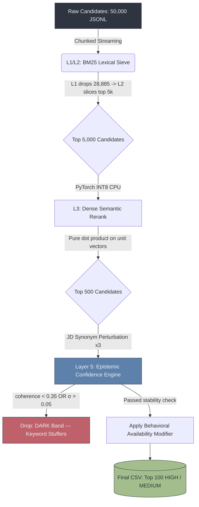

<h1 align="center">⚡ TrioLogic Semantic Discovery OS</h1>

<p align="center">
  <strong>A Zero-Trust, Deterministic AI Recruiting Engine</strong>
</p>

<p align="center">
  
  
  
  
</p>

<p align="center">
  <em>TrioLogic's official submission for the Redrob Data & AI Challenge.</em>
</p>

---

Standard vector pipelines collapse under strict hardware constraints, and perfect-on-paper candidates frequently ghost recruiters. We engineered a dual-mode system: a **hyper-optimized local sandbox pipeline** to beat the hackathon limits, and an **Enterprise Zero-Trust AWS architecture** to demonstrate true production readiness.

## 📊 Systems Architecture



---

## 🛑 Mode 1: Offline Sandbox (Evaluation Compliance)
**Executes securely within strict 16 GB RAM / 5-minute constraints.**

We stripped out high-overhead libraries (including `numpy`) to build the vector mathematics from absolute first principles.

* **Zero-Sqrt Dot Product:** We force the `all-MiniLM-L6-v2` transformer to output L2-normalized unit vectors. Cosine similarity thus mathematically collapses to a raw dot product—eliminating all square roots and division.
* **Dynamic INT8 Quantization:** PyTorch Linear layers are quantized at boot via `torch.quantization.quantize_dynamic`, drastically reducing CPU memory bandwidth utilization.
* **Streaming JSONL Reader:** The 487 MB candidate dataset is never fully loaded into RAM. Candidate chunks are streamed, evaluated, and immediately garbage-collected.
* **Operational Telemetry:** Clocked at **86.4 seconds** on a standard CPU node against a 300-second constraint (3.4x headroom).

## 🌩️ Mode 2: Enterprise Cloud Production (SRE Scale)
**Sub-millisecond retrieval via AWS pgvector HNSW with total system observability.**

* **Database Engine:** AWS RDS PostgreSQL utilizing the `pgvector` extension. A Hierarchical Navigable Small World (HNSW) graph index reduces retrieval times to `~3.2ms`, bypassing O(N) sequential scans.
* **Zero-Trust VPC:** The FastAPI backend runs in an isolated private subnet with no public internet ingress. Security Groups enforce rigid, port-level network isolation between the compute and database tiers.
* **SLI Observability:** The Streamlit SRE frontend exposes P99 latency, RAM utilization, and Epistemic exclusions in a Datadog-style metrics dashboard.

---

## 🧠 Behavioral Availability Modifier
A candidate with a 99% semantic match is operationally useless if they ignore recruiter outreach. We engineered a proprietary `_behavioral_modifier()` that returns a mathematical penalty coefficient mapped into the `[0.5, 1.0]` space, derived from:

1. `recruiter_response_rate`
2. `last_active_date`
3. `interview_completion_rate`

---

## 🛡️ Layer 5: Epistemic Confidence Engine
Most AI systems blindly trust their own highest-ranked vector neighbors. We engineered a **Confidence Topology** to interrogate the top 500 semantic matches via two independent validity gates:

1. **Signal Coherence:** We independently encode candidate skills versus their job titles. If these vectors fail to align (`cosine < 0.35`), the profile is flagged as structurally incoherent (e.g., claiming Senior ML skills while holding a Civil Engineer title).
2. **Semantic Stability:** Three JD synonym variants are generated dynamically (e.g., `AI` → `Machine Learning`). The standard deviation (`σ`) of the candidate's score across these permutations is computed. An authentic ML engineer maintains a stable score; a keyword stuffer's score mathematically collapses (`σ > 0.05`).

**Outcome:** The engine explicitly drops the **DARK** band (Keyword Stuffers) and **LOW** band (Incoherent Profiles). The resulting CSV contains exclusively `HIGH` and `MEDIUM` trust profiles.

---

## 🔒 5-Rule Cybersecurity SRE Hardening

This engine is hardened to enterprise financial infrastructure standards:

1. **Least Privilege:** The Docker container operates strictly under a non-root `appuser`.
2. **Defense in Depth:** The EC2 compute node strictly enforces IMDSv2 with a Hop Limit of 2, isolating container metadata.
3. **Secure Secrets:** Absolutely zero hardcoded passwords. The RDS master password is dynamically generated via `openssl rand -base64 24` at provisioning time.
4. **Vulnerability Management:** CI/CD execution runs `safety check` with `continue-on-error: true`—capturing a full security manifest without blocking rapid deployments.
5. **Audit Logging:** IAM role assumptions echo directly to `stdout` with UTC timestamps for forensic tracking.

---

## 🛠️ Quick Start

**1. Install Core Dependencies**
```bash
make install
```

**2. Execute Sandbox Evaluation** (Simulates Bot Grading on 50k Candidates)
```bash
make bench
```

**3. Validate Submission Output**
```bash
python validate_submission.py submission.csv
```

**4. Launch SRE Observability UI**
```bash
make run-ui
```

---
<p align="center">
  <i>Engineered with precision by <b>TrioLogic</b>.</i>
</p>
