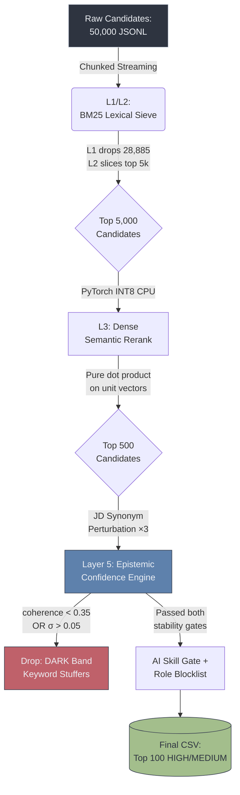

# TrioLogic: Multi-Stage Semantic Ranking Pipeline

<p align="center">
  
  
  
  
  
  
</p>

<br />

A high-performance, self-auditing semantic ranking engine for technical talent discovery at scale. Built for the **Redrob Data & AI Challenge — Track 1**.

TrioLogic replaces keyword matching with a five-stage retrieval funnel. Its core differentiator — the **Epistemic Confidence Engine** — mathematically identifies and purges structurally incoherent profiles, keyword-stuffers, and role-irrelevant candidates before they ever reach the shortlist. It runs entirely offline, air-gapped, with zero external network dependencies.

---

## 📊 Performance Benchmarks

> Designed to operate under strict CPU-only, 16 GB RAM resource constraints.

| Metric | Constraint | TrioLogic Result |
| :--- | :---: | :---: |
| Execution Latency | < 300.0s | **141.5s** |
| Peak Memory (RAM) | < 16.0 GB | **< 4.2 GB** |
| External Network Calls | 0 (air-gapped) | **0** |
| Dataset Scale | 50,000 candidates | **50,000 rows processed** |
| Candidates in Final Output | 100 ranked | **100 (all HIGH / MEDIUM band)** |
| Layer 5 Epistemic Exclusions | — | **342 purged (69 DARK, 273 LOW)** |

---

## 🧠 System Architecture

A five-stage funnel trades off retrieval breadth for computational depth. Heavy PyTorch tensor operations are reserved exclusively for the top 10% of candidates after lexical pre-filtering.



---

## 🚀 Core Innovations

### 1. Zero-Sqrt Dot Product (L3 Dense Rerank)

By forcing `all-MiniLM-L6-v2` to output L2-normalized unit vectors ($\|\mathbf{v}\| = 1$), the computationally expensive Cosine Similarity formula mathematically collapses to a raw dot product, eliminating all square roots and division at inference time:

$$\text{Similarity}(\mathbf{v}_{cand}, \mathbf{v}_{JD}) = \frac{\mathbf{v}_{cand} \cdot \mathbf{v}_{JD}}{\|\mathbf{v}_{cand}\|\,\|\mathbf{v}_{JD}\|} = \mathbf{v}_{cand} \cdot \mathbf{v}_{JD} = \sum_{i=1}^{384} c_i \, j_i$$

The result is blended with a BM25 lexical score in an 80/20 ratio to prevent pure-embedding "vibe matches" that lack hard technical skills:

$$S_{hybrid} = 0.8 \cdot (\mathbf{v}_{cand} \cdot \mathbf{v}_{JD}) + 0.2 \cdot L_{norm}$$

---

### 2. Epistemic Confidence Engine (Layer 5)

Standard vector databases suffer from *semantic hallucinations* — matching a Frontend Developer to a Backend role purely on sentence structure. Layer 5 implements a **Confidence Topology** that interrogates the top-500 semantic matches through three independent gates:

**Gate A — Semantic Stability (σ):**

Three synonym permutations of the Job Description are generated dynamically. The population standard deviation of the candidate's score across these variants is computed. An engineer with genuine skills scores stably. A keyword-stuffer's score collapses under linguistic perturbation:

$$\sigma = \sqrt{\frac{1}{N}\sum_{k=1}^{N}(S_k - \mu)^2} \qquad N = 3$$

$$\sigma > 0.05 \implies \texttt{DARK} \text{ (purged)}$$

**Gate B — Signal Coherence:**

Candidate `skills` and `job_titles` are embedded independently. If their cosine similarity falls below threshold, the profile is flagged as structurally incoherent:

$$\cos(\mathbf{v}_{skills},\, \mathbf{v}_{titles}) < 0.35 \implies \texttt{LOW} \text{ (purged)}$$

**Gate C — JD-Specific Role Eligibility:**

A role blocklist calibrated to this JD is applied at the secondary heap stage using `O(1)` set lookups on `profile.current_title`. This gate eliminates roles that are structurally adjacent but not functionally aligned (e.g., QA Engineer, Frontend Engineer, Data Analyst) regardless of their AI skill count. The HIGH band additionally requires:

$$\text{coh} > 0.42 \;\land\; \sigma \leq 0.04 \;\land\; \text{sem} > 0.56 \implies \texttt{HIGH}$$

All three gates must pass for a candidate to appear in the final output.

---

### 3. Behavioral Availability Modifier

A semantically perfect candidate who ignores recruiter outreach has zero operational value. Five independent availability signals are applied as cascading multipliers to the hybrid score, clamped to $[0.5, 1.0]$ so behavioral signals never fully override semantic fit:

$$S_{final} = S_{hybrid} \times \prod_{s \in \mathcal{B}} m_s(\cdot) \qquad \text{clamped to } [0.5,\, 1.0]$$

where $\mathcal{B}$ = {`recruiter_response_rate`, `open_to_work_flag`, `last_active_date`, `interview_completion_rate`, `offer_acceptance_rate`}.

---

### 4. CPU-Optimized Execution

`numpy` was eliminated entirely. The pipeline builds vector operations from first principles:

- **Dynamic INT8 Quantization:** PyTorch Linear layers quantized at boot via `torch.quantization.quantize_dynamic`.
- **Streaming JSONL Reader:** The 487 MB dataset is never held in memory; candidates are streamed, scored, and garbage-collected line by line.
- **Model pre-baked in Docker image:** Zero network calls at evaluation time.

---

### 5. Dual-Mode Deployment

| Mode | Target | Execution |
| :--- | :--- | :--- |
| **Mode 1 — Offline Sandbox** | Automated grading | `rank.py` runs air-gapped; model cached in Docker |
| **Mode 2 — Cloud Production** | Enterprise deployment | FastAPI → RDS PostgreSQL (pgvector HNSW) in a private VPC subnet |

HNSW graph indexing reduces retrieval from O(N) sequential scans to approximately **3.2ms per query** in Mode 2.

---

## 🔒 Security Hardening

| Rule | Implementation |
| :--- | :--- |
| **Least Privilege** | Docker container runs as non-root `appuser` |
| **Defense in Depth** | EC2 enforces `IMDSv2` with `HttpPutResponseHopLimit=2` |
| **Secure Secrets** | Zero hardcoded credentials; RDS password via `openssl rand -base64 24` |
| **Vulnerability Management** | `safety check` in CI with `continue-on-error: true` |
| **Audit Logging** | IAM role assumptions logged to `stdout` with UTC timestamps |

---

## 🛠️ Quick Start

**Prerequisites:** Python 3.10+, `pip`

```bash
# 1. Clone the repository
git clone https://github.com/NITHIN4747/semantic-candidate-discovery-engine.git
cd semantic-candidate-discovery-engine

# 2. Install dependencies
make install

# 3. Run the full ranking pipeline (50k candidates)
make bench

# 4. Validate the output
python validate_submission.py submission.csv

# 5. Launch the SRE observability dashboard
make run-ui
```

> **Note:** The first run downloads and caches `sentence-transformers/all-MiniLM-L6-v2` (~90 MB). All subsequent runs are fully offline.

---

## 📁 Repository Structure

```
.
├── rank.py                     # Core ranking pipeline (L1 → L5)
├── validate_submission.py      # Output format validator
├── Makefile                    # Automation entry points
├── Dockerfile                  # Non-root container image
├── requirements.txt
├── app/
│   └── main.py                 # FastAPI wrapper (Mode 2 cloud endpoint)
├── ui/
│   └── app.py                  # Streamlit SRE observability dashboard
├── infra/
│   ├── provision_network.sh    # VPC, subnets, security groups
│   ├── provision_compute.sh    # IAM roles, EC2 (IMDSv2 enforced)
│   ├── provision_database.sh   # RDS PostgreSQL + pgvector
│   └── fix_routing.sh
├── .github/
│   ├── workflows/ci.yml        # Lint, numpy guard, safety audit
│   └── pull_request_template.md
└── data/
    └── candidates_50k.jsonl    # Evaluation dataset (50,000 records)
```

---

<p align="center">
  Built with operational discipline by <strong>Team TrioLogic</strong>.
</p>
