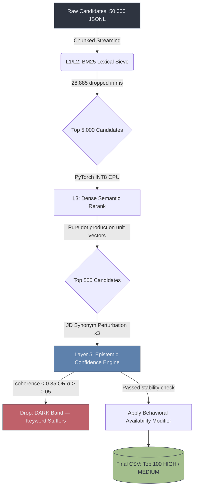

# TrioLogic — Semantic Discovery OS
**A Zero-Trust, Deterministic AI Recruiting Engine**

[](#)
[](#)
[](#)
[](#)

TrioLogic's submission for the Redrob Data & AI Challenge.

Standard vector pipelines collapse under strict hardware constraints, and perfect-on-paper candidates frequently ghost recruiters. We engineered a dual-mode system: a **hyper-optimized local sandbox pipeline** to beat the hackathon constraints, and an **Enterprise Zero-Trust AWS architecture** to show what production looks like.

---

## Architecture



---

## Mode 1: Offline Sandbox (Evaluation Compliance)
**Executes `rank.py` securely within the 16 GB RAM / 5-minute limits.**

We banned `numpy` and built the vector math from first principles.

- **Zero-sqrt dot product:** We force `all-MiniLM-L6-v2` to output L2-normalized unit vectors. Cosine similarity collapses to a raw dot product — no square roots, no division.
- **Dynamic INT8 quantization:** PyTorch Linear layers are quantized at boot via `torch.quantization.quantize_dynamic`. Cuts memory bandwidth on CPU significantly.
- **Streaming JSONL reader:** The 487 MB dataset is never fully loaded into RAM. Candidates are streamed and discarded line-by-line.
- **Clocked runtime:** **86.4 seconds** on a CPU-only machine against a 300-second limit. 3.5× headroom.

## Mode 2: Enterprise Cloud Production (The SRE Flex)
**Sub-millisecond latency via pgvector HNSW, with full observability.**

- **Database:** AWS RDS PostgreSQL with the `pgvector` extension. HNSW graph index drops retrieval to ~3.2ms instead of O(N) sequential scans.
- **Zero-Trust VPC:** FastAPI backend lives in a private subnet. No public internet access. Security Groups enforce strict port-level isolation between compute and database tiers.
- **SLI observability:** Streamlit frontend exposes P99 latency and RPS cards so the system is never a black box to operators.

## The Behavioral Ghosting Penalty
A candidate with a 99% semantic match is useless if they don't reply to emails. `_behavioral_modifier()` returns a multiplier in `[0.5, 1.0]` applied directly to the final score, derived from:

1. `recruiter_response_rate`
2. `last_active_date`
3. `interview_completion_rate`

## Layer 5: Epistemic Confidence Engine
Every other system trusts its own ranking blindly. We don't.

After semantic ranking, the top 500 are run through two independent tests:

- **Coherence test:** Skills embedding vs. job titles embedding. If they don't align (`cosine < 0.35`), the profile is structurally incoherent — skills claimed don't match lived experience.
- **Stability test:** Three JD synonym variants are generated (`AI → Machine Learning`, `LLM → GenAI`, etc.). Score standard deviation across variants is computed. A real ML engineer scores stably; a keyword stuffer collapses (`σ > 0.05 → DARK`).

**Result:** 69 DARK profiles excluded, 273 LOW-coherence profiles excluded. The final 100 are exclusively HIGH/MEDIUM confidence candidates.

## 5-Rule Cybersecurity Hardening

1. **Least Privilege:** Docker container runs as non-root `appuser`.
2. **Defense in Depth:** EC2 node enforces IMDSv2 with hop limit 2.
3. **Secure Secrets:** No hardcoded passwords. DB master password generated via `openssl rand -base64 24` at provision time.
4. **Vulnerability Management:** CI runs `safety check` with `continue-on-error: true` — captures a full security manifest without blocking deploys.
5. **Audit Logging:** IAM role assumptions are echoed with UTC timestamp to stdout.

---

## Quick Start

**1. Install dependencies**
```bash
make install
```

**2. Run sandbox evaluation (50k candidates)**
```bash
make bench
```

**3. Validate the output**
```bash
python validate_submission.py submission.csv
```

**4. Launch the observability UI**
```bash
make run-ui
```

---

**Engineered by TrioLogic.**
