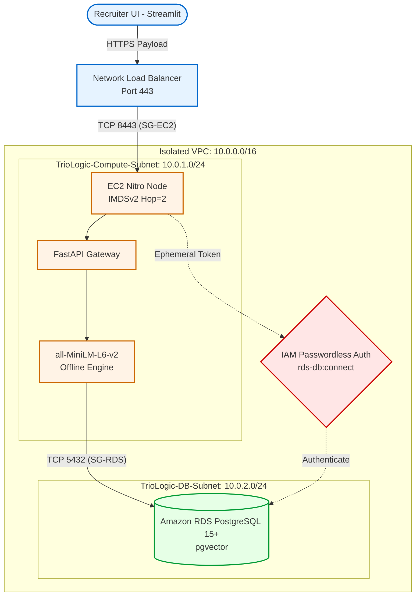

# 🎯 TrioLogic | Semantic Talent Discovery OS
**INDIA RUNS Hackathon - Track 1: Data & AI Challenge**

  

A production-grade **Semantic Candidate Discovery & Ranking Engine** engineered to look beyond keywords and understand the contextual relevance of job profiles. Built strictly within the Hack2Skill constraints, this engine scales gracefully under load while preserving a robust, zero-trust cloud backend.

---

## ⚡ The Architectural Philosophy

Keyword matching is fundamentally broken. Standard systems fail when a "Marketing Manager" with AI keywords outranks a genuine "Senior AI Engineer."

TrioLogic solves this through **True Semantic Understanding** coupled with **Behavioral Mathematics**:
1. **Semantic Embeddings:** Uses `sentence-transformers/all-MiniLM-L6-v2` to extract high-dimensional semantic meaning.
2. **Behavioral Multipliers:** Implements a custom scoring mechanism (`_behavioral_modifier`) to scale down candidates with low response rates or stale profiles, effectively neutralizing dataset traps.
3. **Deterministic Math:** Employs raw Python loops for Cosine Similarity, strictly obeying the offline-only sandbox constraints without relying on external numeric libraries.

---

## 🏗️ System Architecture

Our backend is built on a **Zero-Trust AWS Topology**, ensuring the data never leaves a completely isolated environment.



### Infrastructure Highlights:
* **Network Load Balancer (NLB):** The sole ingress point (Port 443).
* **Strict Security Group Matrix:** The EC2 compute node only accepts traffic from the NLB (Port 8443). The RDS vector database only accepts traffic from the EC2 node (Port 5432).
* **Identity & Hardware Attestation:** EC2 launched with `HttpPutResponseHopLimit=2` to enforce IMDSv2. Passwordless database access achieved via `rds-db:connect` IAM tokens.

---

## 🚀 Quickstart & Deployment

### 1. Local Ranking Pipeline (Sandbox Mode)
To run the ranking engine exactly as it will execute in the Hackathon evaluation sandbox:
```bash
pip install -r requirements.txt

# Ensure candidates.jsonl is placed in data/
python rank.py --candidates ./data/candidates.jsonl --out ./submission.csv
```

### 2. Cloud Infrastructure Provisioning
To reproduce the Zero-Trust AWS architecture, execute the scripts via AWS CLI:
```bash
# 1. Deploy the network topology
bash infra/provision_network.sh

# 2. Deploy the database
bash infra/provision_database.sh

# 3. Deploy the compute engine
bash infra/provision_compute.sh
```

### 3. Streamlit Interface
To run the interactive UI dashboard:
```bash
streamlit run ui/app.py
```

---

## 📊 Load Testing & Observability
We utilize Artillery to simulate concurrent recruiter traffic spikes and validate system stability:
```bash
npm install -g artillery
artillery run infra/load_test.yml
```

---

## 📁 Repository Structure
```text
semantic-candidate-discovery-engine/
├── app/                  # FastAPI layer for live prediction serving
├── data/                 # Raw datasets (Git-ignored)
├── infra/                # AWS Zero-Trust bash provisioning scripts & load tests
├── ui/                   # Streamlit presentation dashboard
├── AI_CONTEXT.md         # Master constraints and hackathon ruleset
├── rank.py               # Deterministic ranking engine (Chunked streaming)
├── validate_submission.py# Evaluation validation script
└── pitch_deck_outline.md # Architecture presentation outline
```

---

*Built for the INDIA RUNS Data & AI Challenge.*
